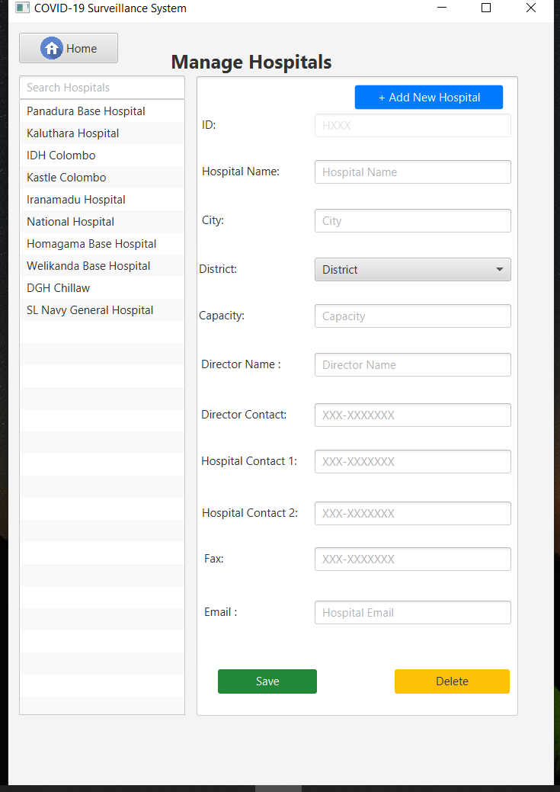

# Covid-19 Surveillance System [JDBC]
> Project represents covid-19 surveillance system using JDBC

## Introduction

> This application represents following functionalities,
        login form    
        manage hospitals
	    manage quarantine centers
	    manage global covid records
	    manage users		

## Requirements

> Before use this application you must need to install JAVA runtime environment and MYSQL database management services..
links :
    [JAVA](https://www.oracle.com/technetwork/java/javase/downloads/jdk8-downloads-2133151.html) ,
    [MySQL](https://www.mysql.com/)

## Technologies
> JAVA FX | 
> JDBC

## Installation

If you did above installations, You only have to double click the jar file and install the jar file..

## Author

name  : Poornima Vithanage

e-mail : vithanagepurnima@gmail.com

[Github] (https://github.com/poornimavithanage)

## Login
> There are 4 user roles(Admin,P.S.T.F/Quarantine Center IT,Hospital IT)

## Main Form

## Managing Hospitals

## Managing Quarantine Centers

## Managing Global Covid Records

## Managing Users

## File Structure

## Installation

* jfoenix-8.0.8.jar
* mysql-connector-java-8.0.20.jar

## License

This project is license under the MIT License - see the [LICENSE.txt](LICENSE.txt) file for details.

